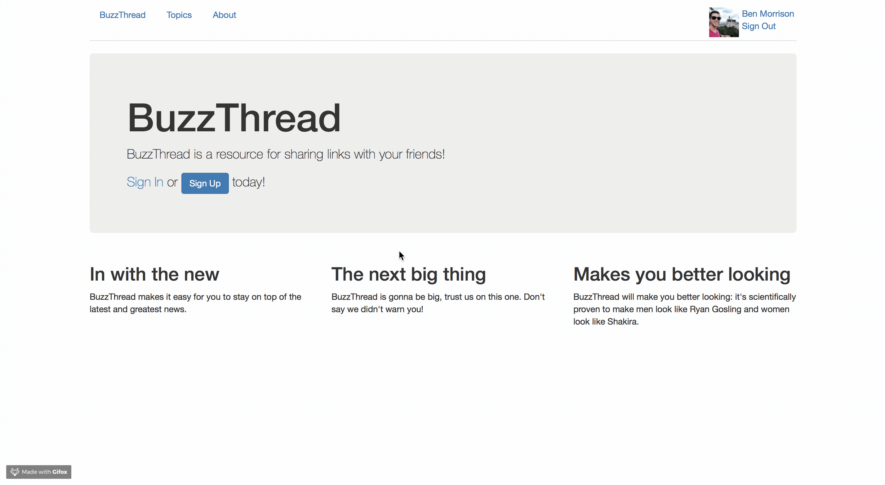

# BuzzThread
## A social media app where users can share and discuss

BuzzThread is a Bootstrap-themed Rails app that allows users to post, share, or ask on forums with other people. It was tested using RSpec and shoulda. This application has its own forms of user authentication and authorization, so there are no gems there.

### Prerequisites

This project was built with `Ruby 2.3.1` and `Rails 4.2.5`. **Do not** use with Rails 5.

### Getting Started

In order to download and use or alter BuzzThread locally, follow these steps:

1. Clone this repository
2. `cd` into your new buzzthread directory
3. Run `bundle install`
4. Setup the database with `rake db:create`, `rake db:migrate`, and `rake db:seed`
5. **Optional**: Edit code to your liking
6. Run `rails s` and navigate to `localhost:3000` in your browser to start using!
